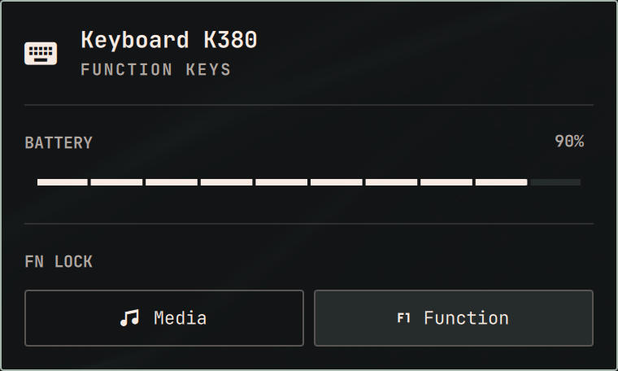

<div align="center">
  
</div>


# ⌨️ K380 Fn-Lock for Omarchy

An [Omarchy](https://omarchy.org) bar widget for the **Logitech K380** Bluetooth keyboard: battery level and switching the top row between **Media** and **Function** keys, without Logi Options+.

I built it because I got tired of holding `Fn` for every `F5`. Now the widget remembers the mode I picked and puts it back as soon as the keyboard reconnects.


## ✨ Features

- **Fn lock in one click**: Media keys or F1–F12 as the default top row
- **Remembered mode**: the K380 resets on power off, and the widget writes your mode back on every reconnect
- **Battery level** straight from the keyboard, with a 10% scale
- **Only there when needed**: the icon appears in the bar while the keyboard is connected
- **Native look**: built from Omarchy's own panel components, follows your theme
- **No root at runtime**: a small C helper talks to the keyboard, and a udev rule gives only your session access to only the K380


## 📦 Install

Requirements: Omarchy Quattro, a K380 paired over Bluetooth, and `make` with a C compiler.

```bash
omarchy plugin add https://github.com/sxardas/omarchy-k380-fnlock.git --enable
```

Then click the keyboard icon in the bar and press **Finish setup**. It builds the helper and installs the udev rule, asking for your password once.


## 🖱️ Usage

| Action                 | Result                                                   |
|------------------------|----------------------------------------------------------|
| **Left click**         | Open the panel: battery and the Media / Function buttons |
| **Right click**        | Flip between Media and Function keys                     |


## 🛠️ How it works

The K380 speaks Logitech's **HID++ 2.0** over its Bluetooth HID interface. `bin/omarchy-k380-fnlock`, built from [`helper/omarchy-k380-fnlock.c`](helper/omarchy-k380-fnlock.c) with nothing but libc, opens the keyboard's `/dev/hidraw*` node, looks up the Fn inversion feature through the HID++ root feature, and reads or flips it. Looking features up instead of replaying fixed bytes is what makes it work across firmware revisions (`0x40A0`, `0x40A2`, `0x40A3`).

```bash
bin/omarchy-k380-fnlock status           # {"mode": "function", "battery": {"percent": 90, ...}, ...}
bin/omarchy-k380-fnlock set media
bin/omarchy-k380-fnlock toggle
```

hidraw nodes are root-only by default. [`udev/70-omarchy-k380-fnlock.rules`](udev/70-omarchy-k380-fnlock.rules) tags only the K380's node (`0005:046D:B342`) with `uaccess`, so the user sitting at the machine can open it.


## 🗑️ Uninstall

```bash
~/.config/omarchy/plugins/io.github.sxardas.omarchy-k380-fnlock/uninstall.sh
```

It removes exactly what the install added: the bar entry and its saved mode, the plugin folder and the udev rule (asks for sudo). Before that it puts the keyboard back to the factory Media keys; pass `--keep-mode` to skip it.

`omarchy plugin remove` alone deletes the folder but leaves the udev rule behind.

---

<div align="center">
  <sub>Built because my K380 kept forgetting its Fn-Lock ;)</sub>
</div>
